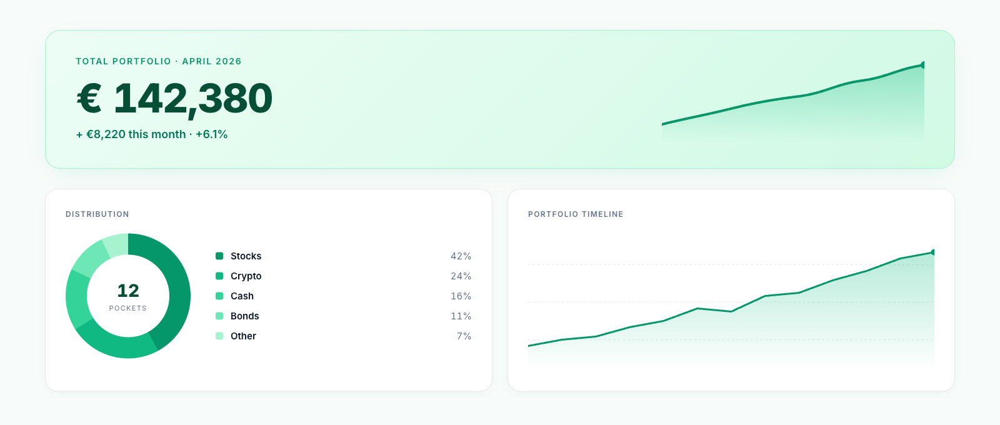

<div align="center">

# One Day Investor

**A calm, visual way to watch your wealth grow.**

Invest one day a month. Group holdings into pockets, snapshot your whole net
worth, and watch the trend — instead of watching the market.

[](https://bun.sh)
[](https://www.typescriptlang.org/)
[](https://elysiajs.com)
[](https://react.dev)
[](https://www.postgresql.org/)
[](LICENSE)

[**Live site**](https://odinvestor.net) · [Philosophy](https://odinvestor.net/philosophy) · [Blog](https://blog.odinvestor.net) · [Agent spec](https://odinvestor.net/agents.json)



</div>

---

## The idea

Most portfolio trackers assume you want to watch the market every day. This one
assumes the opposite.

Once a month you open the app and take a **snapshot** — a dated photograph of
everything you own. Stocks and crypto price themselves; a flat, a car, or cash
under the mattress you set by hand. What matters isn't whether one holding dipped
this week, it's the month-over-month line toward the number you're aiming at.

Holdings live in **pockets** you nest however you actually think — by broker, by
strategy, by goal. Read-only exchange keys sync balances automatically.

## Highlights

A few things in here worth a look:

- **[Agent-ready API](#agent-api)** — a public, self-describing `/agents.json`
  manifest plus scoped bearer tokens, so an LLM can manage a portfolio over plain
  HTTP without a custom SDK. Tokens carry a per-service path allowlist; anything
  off-spec returns 403.
- **Credentials encrypted at rest** — exchange API keys are sealed with
  AES-256-GCM ([`packages/exchange/src/crypto.ts`](packages/exchange/src/crypto.ts));
  agent tokens are stored only as SHA-256 hashes with a `last4` for display.
- **Nine exchange adapters** behind one interface — Binance, Bybit, Kraken,
  Coinbase, OKX, KuCoin, Bitfinex, Crypto.com, Revolut X — all read-only, no
  trading or withdrawal scopes.
- **Eight services in one Bun workspace**, each with its own OpenAPI document
  served through Scalar.
- **Per-branch preview environments** — every branch gets a disposable full-stack
  deploy ([`docs/hoster-previews.md`](docs/hoster-previews.md)).
- **A written design record** — 47 dated specs and plans in
  [`docs/`](docs/README.md), one per feature, written before the code.

## Architecture

Eight deployable services sharing thirteen internal packages, all in a single Bun
workspace.

```
                      ┌──────────────┐
  Browser  ─────────► │   frontend   │  React 19 SPA, Vite, Tailwind
                      └──────┬───────┘
                             │
      ┌──────────────────────┼──────────────────────┐
      ▼                      ▼                      ▼
 ┌─────────┐          ┌────────────┐          ┌──────────┐
 │  core   │          │   market   │          │analytics │
 │  :3000  │          │   :3002    │          │  :3001   │
 └────┬────┘          └─────┬──────┘          └────┬─────┘
      │  auth, pockets,     │  prices, catalog,    │  timeline,
      │  snapshots, agents  │  exchange sync       │  distribution
      └──────────┬──────────┴──────────┬───────────┘
                 ▼                     ▼
          ┌────────────┐        ┌────────────┐
          │ PostgreSQL │        │   Redis    │
          └────────────┘        └────────────┘

 Supporting:  site :3005 (landing, SSR)   blog :3003 (SSR + admin CMS)
              og :3004 (OG images)        reminder (monthly email cron)
```

| Service | Port | What it does |
|---|---|---|
| `core` | 3000 | Google OAuth, sessions, pockets, assets, snapshots, agent tokens, admin |
| `analytics` | 3001 | Portfolio timeline, distribution, largest holdings |
| `market` | 3002 | Live prices, asset catalog search, exchange balance sync |
| `blog` | 3003 | Server-rendered blog with an admin editor |
| `og` | 3004 | On-demand Open Graph images via Puppeteer |
| `site` | 3005 | Server-rendered landing and philosophy pages (EN/RU/ES) |
| `frontend` | 5173 | React dashboard SPA |
| `reminder` | — | Monthly "take your snapshot" emails via Mailgun |

Shared packages: `config` (convict schema, strict-validated at boot), `database`
(pg + node-pg-migrate), `exchange`, `market`, `mailgun`, `storage` (S3), `redis`,
`logger` (pino), `notifications`, `assets`, `ui`, `icons`, `types`.

## Tech stack

**Runtime** Bun · TypeScript · [Elysia](https://elysiajs.com) HTTP framework
**Frontend** React 19 · Vite · Tailwind CSS · Radix UI · TanStack Query · Recharts · react-i18next
**Server rendering** `@kitajs/html` JSX for the site and blog
**Data** PostgreSQL · Redis · S3 / MinIO
**Infra** Docker Compose · nginx · GitHub Actions → GHCR → SSH deploy · Ghost · Uptime Kuma
**API docs** OpenAPI via `@elysiajs/swagger`, rendered with Scalar

## Quick start

Requires [Bun](https://bun.sh) 1.3+ and Docker.

```bash
git clone https://github.com/VladosusCocosus/one-day-investor.git
cd one-day-investor
bun install

cp .env.example .env          # works as-is for everything but Google sign-in
docker compose up -d          # Postgres, Redis, MinIO
bun run migrate               # apply the 20 migrations
```

The defaults match the compose stack, so the services boot as-is. Two entries
are left blank on purpose:

- `GOOGLE_CLIENT_ID` / `GOOGLE_CLIENT_SECRET` — required to sign in. From
  [Google Cloud Console](https://console.cloud.google.com) → *APIs & Services* →
  *Credentials* → *OAuth client ID*. Add
  `http://localhost:3000/auth/google/callback` as an authorised redirect URI.
- `EXCHANGE_ENCRYPTION_KEY` — only needed to connect an exchange.
  Generate with `openssl rand -hex 32`.

Then start whichever services you need, each in its own shell:

```bash
bun run dev:core        # :3000  API, auth, snapshots, agent tokens
bun run dev:frontend    # :5173  dashboard
bun run dev:market      # :3002  prices and exchange sync
bun run dev:analytics   # :3001  charts
```

`dev:site`, `dev:blog` and `dev:og` start the remaining services. Each script
loads the root `.env` before handing off to the workspace — running
`bun run --cwd apps/core dev` directly skips that, and the service falls back to
its built-in defaults.

Open http://localhost:5173 and sign in with Google.

Interactive API docs live at `/api/swagger` on each backend service —
e.g. http://localhost:3000/api/swagger.

## Agent API

The dashboard can issue bearer tokens that let an LLM read and write a portfolio
over plain HTTP — no SDK, no vendor lock-in.

Discovery starts at a public manifest:

```
GET https://odinvestor.net/agents.json
```

It names the three callable services, points at each one's OpenAPI document, and
declares exactly which path prefixes a token may reach:

```jsonc
{
  "auth": { "type": "bearer", "expiry_options": ["1h", "6h", "24h", "7d", "30d"] },
  "capabilities": {
    "allowed_by_service": {
      "core":      ["/api/snapshots", "/api/services", "/api/assets", "/api/catalog"],
      "market":    ["/api/asset-catalog", "/api/pocket-assets/{service_id}", "/api/market"],
      "analytics": ["/api/analytics"]
    },
    "denied": ["admin", "user-settings", "notifications", "exchange-credentials"]
  }
}
```

Anything outside the allowlist returns 403 — including every route that touches
account settings or exchange credentials. Tokens expire in 1 hour to 30 days and
can be revoked from the dashboard at any time.

## Repository layout

```
apps/
  core/         API, OAuth, sessions, pockets, snapshots, agent tokens
  analytics/    portfolio analytics endpoints
  market/       prices, catalog, exchange sync
  frontend/     React dashboard
  site/         SSR landing pages, i18n
  blog/         SSR blog + admin CMS
  og/           Open Graph image service
  reminder/     monthly reminder emails
  ghost/        self-hosted Ghost stack
  uptime-kuma/  uptime monitoring stack
packages/       thirteen shared internal packages
docker/         one Dockerfile per service
nginx/          reverse-proxy configs
docs/           design specs, implementation plans, runbooks
```

## Deployment

Pushing to `main` triggers [`.github/workflows/deploy.yml`](.github/workflows/deploy.yml):
eight images build in parallel, push to GHCR, then the server pulls and restarts
via `docker-compose.prod.yml` over SSH. Non-`main` branches get disposable
preview environments instead — see [`docs/hoster-previews.md`](docs/hoster-previews.md).

## Project status

A working product, in production at [odinvestor.net](https://odinvestor.net),
built and maintained solo.

Known gaps, stated plainly: there is **no automated test suite** — the `test`
script in `apps/core` is still the npm placeholder. Test coverage is the main
thing this codebase is missing.

## Documentation

[`docs/README.md`](docs/README.md) indexes the design record: a spec and an
implementation plan for each feature, written before the code and dated.

## License

[MIT](LICENSE) © Vladislav Razin
